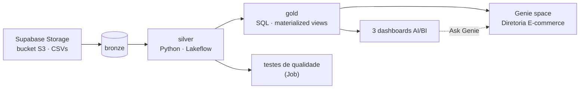

# Engenharia de dados de e-commerce no Databricks

Projeto de ponta a ponta no Databricks: dados brutos de um e-commerce viram uma **arquitetura
medalhão** (bronze → silver → gold) e três produtos para a diretoria: **dashboards AI/BI**, um
**agente do Genie** que responde perguntas em português e um **Job** com testes de qualidade.
Tudo como código, em um único Declarative Automation Bundle (antigo Databricks Asset Bundle).



## O que tem aqui

| Camada | O que faz | Onde |
|---|---|---|
| Bronze | Vendas, produtos, clientes e preços de concorrentes, como chegam da origem | Bucket S3 no Supabase Storage |
| Silver | Limpeza, tipos, deduplicação e **marcação** (sem descarte) de problemas de qualidade, medidos com expectations | `lakeflow_project/src/lakeflow_project_etl/transformations/silver/` |
| Gold | Uma tabela por pergunta de negócio, com comentário em cada coluna (unidade, regra de cálculo, o que não pode ser somado) | `lakeflow_project/src/lakeflow_project_etl/transformations/gold/` |
| Dashboards | Um dashboard AI/BI por diretoria: Comercial, Customer Success e Pricing | `lakeflow_project/src/dashboards/` |
| Genie | Agente "Diretoria E-commerce": perguntas em linguagem natural sobre as 5 golds | `lakeflow_project/src/genie/` |
| Testes | Notebook que valida chaves únicas e regras de receita depois do pipeline | `lakeflow_project/testes/` |

### Tabelas gold

| Tabela | Grão | Diretoria |
|---|---|---|
| `gold.vendas_temporais` | data × hora × canal | Comercial: quando e em qual canal |
| `gold.vendas_produtos` | produto vendido | Comercial: com quais produtos |
| `gold.clientes_segmentacao` | cliente (VIP, TOP_TIER, REGULAR) | Customer Success |
| `gold.precos_competitividade` | produto com preço de concorrente | Pricing: Mercado Livre, Amazon, Magalu, Shopee |
| `gold.vendas_detalhadas` | venda | Perguntas que cruzam diretorias |

### Dashboards

- **Diretoria Comercial**: receita, vendas, ticket médio e itens; receita por dia e canal, por dia
  da semana (média por dia), por hora e por categoria; top 10 produtos. Filtros de período e canal.
- **Diretoria de Customer Success**: clientes, VIPs e sua participação na receita; receita por
  segmento e região; ranking de clientes. Filtros de segmento e região.
- **Diretoria de Pricing**: produtos mais caros que todos os concorrentes, separando preços
  **confirmados** dos **suspeitos** (erro de coleta ou promoção), diferença vs. mercado por
  categoria e tabela de ação ordenada por receita.

### Agente do Genie

O space "Diretoria E-commerce" tem instruções de negócio, joins, SQL de exemplo, sinônimos e
perguntas iniciais. Ele foi validado pela API de conversa com 10 perguntas de aceitação e 2 de
limite ("Qual foi o nosso lucro?", "Quanto vendemos ontem?"), comparando cada resposta com SQL
direto na gold: **10/10 e 2/2**.

## Decisões que valem destacar

- **Nunca descartar venda.** Venda de produto não cadastrado ou anterior ao cadastro é marcada em
  uma coluna e medida com `@dp.expect` (warn): apagar a linha mudaria a receita.
- **Materialized views com leitura batch**, porque a bronze é sobrescrita a cada ingestão.
- **Dinheiro em `DECIMAL(10,2)`** e receita = quantidade × preço, centavo a centavo.
- **Ticket médio é receita total ÷ número de vendas**, nunca média de médias.
- **Dia da semana pela receita média por dia**: o período tem 5 sábados e 5 domingos e só 4 de
  cada dia útil.
- **Consultas dos dashboards sem catálogo nem schema** (`FROM vendas_temporais`), para o mesmo
  dashboard funcionar em dev e prod.
- **O space do Genie só muda pelo JSON + deploy**, nunca pela interface.

## Como rodar

Pré-requisitos: [Databricks CLI](https://docs.databricks.com/dev-tools/cli/install.html)
autenticado, catálogo `ecommerce` com a bronze carregada e um SQL warehouse chamado
"Serverless Starter Warehouse".

```bash
cd lakeflow_project
databricks bundle validate --strict -t dev
databricks bundle deploy -t dev                 # pipeline, job, dashboards e Genie space
databricks bundle run pipeline_ecommerce -t dev # atualiza silver/gold e roda os testes
databricks bundle summary -t dev                # links dos recursos publicados
```

O período dos dados vai de 13/12/2025 a 11/01/2026. Os números de referência para conferir
qualquer mudança (3.020 vendas, receita de R$ 974.077,28, 50 clientes, 215 produtos monitorados)
e todas as convenções do projeto estão em [`lakeflow_project/CLAUDE.md`](lakeflow_project/CLAUDE.md).

## Estrutura

```text
lakeflow_project/
├── databricks.yml              bundle: variáveis (catálogo, warehouse) e targets dev/prod
├── resources/                  pipeline, job, dashboards e Genie space
├── src/
│   ├── lakeflow_project_etl/transformations/
│   │   ├── silver/             Python (pyspark.pipelines)
│   │   └── gold/               SQL (materialized views)
│   ├── dashboards/             *.lvdash.json
│   └── genie/                  diretoria_ecommerce.geniespace.json
├── testes/testes_qualidade.py  testes rodados pelo Job depois do pipeline
└── CLAUDE.md                   convenções e números de referência
```

## Stack

Databricks · Unity Catalog · Lakeflow Spark Declarative Pipelines · Delta Lake · Databricks SQL ·
AI/BI Dashboards · Genie · Declarative Automation Bundles · PySpark · SQL
